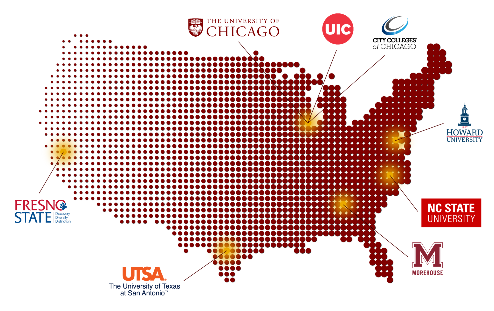

## FATAL: A Study of Fatal Police Interactions in the US

This repository contains some of the base modifications used by our lab in the analysis of [fatal police interactions](https://www.washingtonpost.com/graphics/investigations/police-shootings-database/). Visitors may examine and utilize the modifications outlined to help them prepare for further analysis. Base data files come from the [Fatal Force Database](https://github.com/washingtonpost/data-police-shootings) and many other sources; here we also share the integration of US Census data using the [`tidycensus`](https://walker-data.com/tidycensus/) and [`censusapi`](https://github.com/hrecht/censusapi) packages. 

Shared here are the public files for the **Community Data Fellowship** research project at [Howard University](https://howard.edu/) and [Morehouse College](https://morehouse.edu/) conducted in spring 2023 and fall 2023. Lab members and collaborators should only stage and commit open code; if there are questions it likely means you should use the project's private repository.

**Base files**:

* Base files for data processing are stored in the `code` folder.

* `data`

  - All raw data is stored or saved in the `data` folder.
  
  - Data analysis and results are stored in `output` and `reports` folders.

* **Python scripts** are located in the `python` folder.

**Ancillary files**:

* `api.R` helps new users generate and store a [Census API key](https://api.census.gov/data/key_signup.html).

  - You should never share your Census API key. Follow the steps below:
  
    - Set up an environment variable to hold your api key with `usethis::edit_r_environ()`

    - Transfer information into `.Renviron` (pop-up file) 
    
        - Insert `CENSUS_API_KEY='your_api_key'` into the `.Renviron` file
  
    - Insert your census API key via `Sys.getenv("CENSUS_API_KEY")`

View project resources (forthcoming) at https://github.com/quant-shop/fatalv2

Funding for this project was provided by [Data.org](https://data.org/) in collaboration with the [The University of Chicago Data Science Institute](https://datascience.uchicago.edu/) as a part of the Institute's [Capacity Accelerator Network](https://datascience.uchicago.edu/outreach/capacity-accelerator-network/).

{50%}

